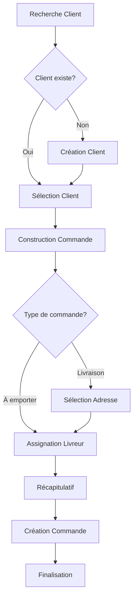

# 🏪 Système de Caisse ChapFood - Documentation

## Vue d'ensemble

Le système de caisse ChapFood est une interface professionnelle et interactive permettant de gérer les commandes manuelles (WhatsApp, téléphone, commandes en magasin) sans modifier les tables existantes de la base de données.

## 🎯 Fonctionnalités

### 1. **Recherche et Création de Clients**
- ✅ Recherche par nom ou numéro de téléphone
- ✅ Création automatique de nouveaux clients
- ✅ Mot de passe par défaut : `123456789`
- ✅ Interface intuitive avec validation

### 2. **Construction de Commande**
- ✅ Sélection d'articles du menu avec images
- ✅ Choix des suppléments et garnitures
- ✅ Gestion des quantités
- ✅ Instructions spéciales par article
- ✅ Panier en temps réel avec calcul automatique

### 3. **Gestion des Types de Commande**
- ✅ Livraison avec sélection d'adresse GPS
- ✅ À emporter (pickup)
- ✅ Calcul automatique des frais de livraison

### 4. **Assignation de Livreurs**
- ✅ Affichage des livreurs disponibles
- ✅ Suivi des livreurs en livraison
- ✅ Position GPS en temps réel
- ✅ Assignation automatique

### 5. **Finalisation de Commande**
- ✅ Récapitulatif complet
- ✅ Instructions spéciales globales
- ✅ Méthodes de paiement (Espèces/Mobile Money)
- ✅ Création automatique dans la base de données

## 🏗️ Architecture

### Composants Principaux

```
src/pages/admin/CashierSystem.tsx
├── ClientSearch.tsx           # Recherche/création clients
├── OrderBuilder.tsx           # Construction commande
├── DeliveryLocationPicker.tsx # Sélection adresse (existant)
├── DriverAssignment.tsx       # Assignation livreur
└── OrderSummary.tsx           # Récapitulatif et finalisation
```

### Flux de Données



## 🗄️ Utilisation des Tables Existantes

### Tables Utilisées
- ✅ `users` - Clients
- ✅ `menu_items` - Articles du menu
- ✅ `supplements` - Suppléments et garnitures
- ✅ `categories` - Catégories d'articles
- ✅ `orders` - Commandes
- ✅ `order_items` - Détails des commandes
- ✅ `drivers` - Livreurs
- ✅ `order_driver_assignments` - Assignations livreurs
- ✅ `user_notifications` - Notifications clients

### Aucune Modification de Structure
- ✅ Aucune nouvelle table créée
- ✅ Aucune colonne ajoutée
- ✅ Compatible avec le système existant

## 🔄 Processus de Commande

### 1. **Étape Client**
```typescript
// Recherche client existant
const { data } = await supabase
  .from('users')
  .select('*')
  .or(`full_name.ilike.%${searchTerm}%,phone.ilike.%${searchTerm}%`)

// Création nouveau client
const userData = {
  id: crypto.randomUUID(),
  full_name: formData.full_name,
  phone: formData.phone,
  password: '123456789', // Mot de passe par défaut
  email: formData.email,
  address: formData.address,
  is_active: true
}
```

### 2. **Étape Commande**
```typescript
// Chargement du menu
const { data: menuItems } = await supabase
  .from('menu_items')
  .select('*')
  .eq('is_available', true)

// Chargement des suppléments
const { data: supplements } = await supabase
  .from('supplements')
  .select('*')
  .eq('is_available', true)
```

### 3. **Étape Livreur**
```typescript
// Livreurs disponibles
const { data: drivers } = await supabase
  .from('drivers')
  .select('*')
  .eq('is_available', true)

// Livreurs occupés
const { data: busyDrivers } = await supabase
  .from('order_driver_assignments')
  .select('driver_id')
  .is('delivered_at', null)
```

### 4. **Finalisation**
```typescript
// Création de la commande
const orderData = {
  customer_id: client.id,
  customer_name: client.full_name,
  customer_phone: client.phone,
  delivery_type: orderType,
  delivery_address: deliveryLocation?.address,
  subtotal: orderTotal,
  delivery_fee: orderType === 'delivery' ? 2000 : 0,
  total_amount: finalTotal,
  payment_method: paymentMethod,
  status: 'pending',
  created_via: 'cashier_system'
}

// Création des articles
const orderItems = cart.map(item => ({
  order_id: order.id,
  menu_item_id: item.menu_item.id,
  quantity: item.quantity,
  selected_extras: item.selected_extras,
  selected_garnitures: item.selected_garnitures,
  special_instructions: item.special_instructions
}))

// Assignation livreur
const assignmentData = {
  order_id: order.id,
  driver_id: assignedDriver.id,
  assigned_at: new Date().toISOString(),
  status: 'assigned'
}
```

## 📱 Intégration App Mobile

### Connexion Client
- ✅ Le client créé peut se connecter avec ses identifiants
- ✅ Numéro de téléphone + mot de passe par défaut
- ✅ Possibilité de changer le mot de passe dans l'app

### Suivi de Commande
- ✅ Notification automatique de création de commande
- ✅ Suivi en temps réel via l'app mobile
- ✅ Position GPS du livreur (si activée)

## 🎨 Interface Utilisateur

### Design ChapFood
- ✅ Couleurs orange, rouge, jaune, vert, bleu, violet
- ✅ Gradients et effets glassmorphism
- ✅ Animations et transitions fluides
- ✅ Interface responsive

### Barre de Progression
- ✅ 6 étapes visuelles
- ✅ Indicateurs de progression
- ✅ Navigation intuitive

### Panneau Latéral
- ✅ Résumé client en temps réel
- ✅ Panier avec calcul automatique
- ✅ Informations livreur assigné

## 🔧 Configuration

### Route
```typescript
<Route path="/admin/cashier" element={<CashierSystem />} />
```

### Accès
- ✅ Lien dans le dashboard principal
- ✅ Bouton "Système de Caisse"
- ✅ Accès réservé aux administrateurs

## 🚀 Utilisation

### Pour l'Administrateur
1. Cliquer sur "Système de Caisse" dans le dashboard
2. Rechercher ou créer un client
3. Construire la commande (articles + suppléments)
4. Choisir le type (livraison/emporter)
5. Assigner un livreur si nécessaire
6. Finaliser et créer la commande

### Pour le Client
1. Recevoir une notification de création
2. Se connecter à l'app mobile avec ses identifiants
3. Suivre sa commande en temps réel
4. Voir la position du livreur (si assigné)

## 🎯 Avantages

### Pour l'Administrateur
- ✅ Interface professionnelle et intuitive
- ✅ Gestion complète sans modification BD
- ✅ Intégration parfaite avec le système existant
- ✅ Suivi en temps réel des commandes

### Pour le Client
- ✅ Accès immédiat à l'app mobile
- ✅ Suivi de commande en temps réel
- ✅ Notifications automatiques
- ✅ Expérience utilisateur fluide

## 🔮 Évolutions Futures

### Fonctionnalités Possibles
- 📊 Statistiques de ventes par caissier
- 🎯 Gestion des promotions et réductions
- 📱 QR Code pour paiement mobile
- 🔄 Synchronisation temps réel avec l'app mobile
- 📈 Tableau de bord caissier dédié

## 📝 Notes Techniques

### Performance
- ✅ Chargement optimisé des données
- ✅ Gestion d'état efficace avec React
- ✅ Requêtes Supabase optimisées

### Sécurité
- ✅ Validation côté client et serveur
- ✅ Gestion d'erreurs robuste
- ✅ Authentification admin requise

### Compatibilité
- ✅ Compatible avec toutes les fonctionnalités existantes
- ✅ Aucun impact sur les autres modules
- ✅ Évolutif et maintenable

---

**Le système de caisse ChapFood est maintenant opérationnel et prêt à être utilisé !** 🎉


