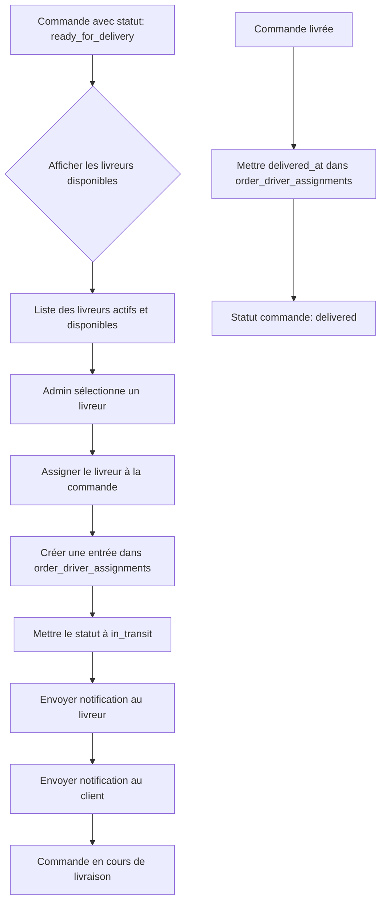

# Flux d'Assignation des Livreurs

## Diagramme du processus

## Règles métier

### 1. Livreurs disponibles
- ✅ `is_active = true`
- ✅ `is_available = true`
- ✅ Pas de livraison en cours (`delivered_at IS NULL` dans `order_driver_assignments`)

### 2. Assignation
- Une commande ne peut avoir qu'un seul livreur assigné à la fois
- L'assignation crée automatiquement le statut `in_transit`
- Le livreur reçoit une notification immédiate

### 3. Statut `in_transit`
- **OBLIGATOIRE** : Un livreur doit être assigné
- Impossible de passer en `in_transit` sans assignation
- Interface désactive l'option si aucun livreur assigné

### 4. Livraison terminée
- Quand le statut passe à `delivered`
- `delivered_at` est mis à jour dans `order_driver_assignments`
- Le livreur redevient disponible pour d'autres commandes

## Tables affectées

### Tables modifiées lors de l'assignation :
1. **`order_driver_assignments`** - Nouvelle assignation
2. **`orders`** - Statut mis à `in_transit`
3. **`driver_notifications`** - Notification au livreur
4. **`order_notifications`** - Notification au client

### Tables modifiées lors de la livraison :
1. **`order_driver_assignments`** - `delivered_at` mis à jour
2. **`orders`** - Statut mis à `delivered`, `actual_delivery_time`

## Interface utilisateur

### États du modal :
1. **ready_for_delivery sans livreur** → Affiche la liste des livreurs disponibles
2. **ready_for_delivery avec livreur** → Affiche le livreur assigné
3. **in_transit** → Affiche le livreur assigné (lecture seule)
4. **delivered** → Affiche le livreur qui a livré

### Validations :
- Bouton "in_transit" désactivé si aucun livreur assigné
- Message d'avertissement si tentative de passer en `in_transit` sans livreur
- Liste des livreurs actualisable en temps réel

